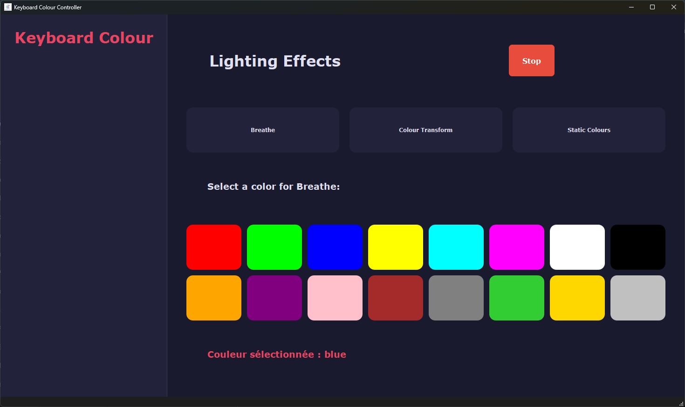
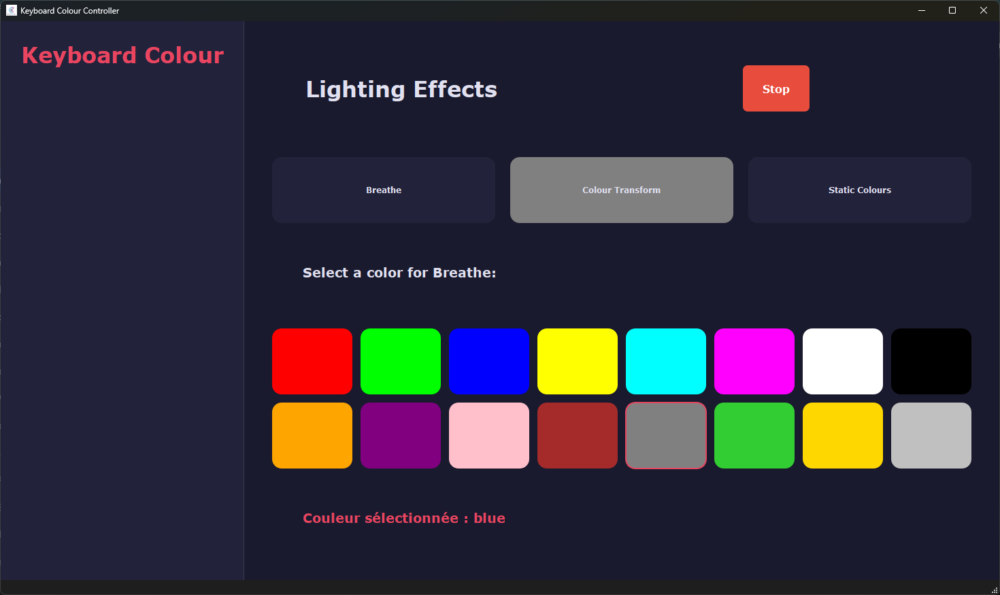

# CLEVO Keyboard Colour Program (C++)

**A C++ version of the original "keyboard-colour-program" developed in C#.**

This is a cleaner, more organized, and efficient version of the initial program. It is designed to provide enhanced features for customizing CLEVO keyboards with **RGB** lighting, supporting both **3-zone** and **1-zone** keyboards. The program also includes a variety of animated effects to enhance your keyboard’s visual experience.

---

## 🎨 Current Features

- **Support for CLEVO keyboards:**
  - **RGB 3-zone keyboards**.
  - **RGB 1-zone keyboards**.
- **Predefined Animated Effects:**
  - 🌈 **Fading Colors:** Smooth color transitions (predefined themes).
  - 🎥 **Optimized Animations:** Enhanced visual effects using animation objects.
- **New Graphical User Interface (GUI):**
  - Simplifies control with **buttons and a color picker**.
  - Includes the **new 'Single Breathe' animation** with custom color selection.

⚠️ **Important Note:** Ensure you run this program **as an administrator**, as Windows Management Instrumentation (WMI) requires administrative privileges to function properly.

⚠️ **Warning:** The predefined fading theme may utilize **15% to 20% of CPU** at certain times. This will be optimized in future updates.

⚠️ **Warning (2):** Ensure that the **InsydeDHCU.dll** file is in the same directory as `CLEVO_KeyboardColour.exe` if you're using a **Single-Zone** keyboard.

---

## 🖥️ New: Graphical User Interface (GUI)

The program now includes a dedicated **Graphical User Interface (GUI)** named `KeyboardColor.exe` for simplified control, eliminating the need to use the command line for basic features.

### ✨ GUI Features

The GUI offers a simplified way to manage your keyboard lighting:

* **Animation Selection:** Easily switch between the **Breathe** and **Colour Transform** modes using dedicated buttons.
* **New Single Breathe Mode:** Perform a smooth breathing animation using **one user-selected custom color**.
* **Color Picker:** A graphical tool is available to select the custom color for the **Single Breathe** mode.
* **Color Enhancements:** All newly added colors for the `colourtransform` and `freshbreathe` effects are available.

---

## 🔧 Functional Commands

The following commands are supported and can be executed via the **Command Prompt**.

### 🖥️ General Syntax:
Navigate to the folder containing the executable files (e.g., `CppKeyboardColour/Build/`) and run the commands in **administrator mode**. To execute the `.exe` files, prepend the `.\` before the command.

```bash
.\CLEVO_KeyboardColour.exe theme [themeName]
```

### 🎨 Supported Themes:

- **Turn Backlight Off:**  
  ```bash
  .\CLEVO_KeyboardColour.exe theme off
  ```
  🖤 Turns off the keyboard backlight.

- **Default Backlight:**
  ```bash
  .\CLEVO_KeyboardColour.exe theme default
  ```
  💙 Enables the default keyboard backlight colour (Solid Blue).

- **Breathing Effect:**  
  ```bash
  .\CLEVO_KeyboardColour.exe theme breathe
  ```
  🌬️ Enables a breathing effect (smooth pulsing transitions between colors).

- **Colourshift:**  
  ```bash
  .\CLEVO_KeyboardColour.exe theme colourshift
  ```
  🔄 Alternates colors for **RGB** keyboards (designed for 3-zone keyboards only!).

- **Fresh Breathe:**  
  ```bash
  .\CLEVO_KeyboardColour.exe theme freshbreathe
  ```
  🌀 A custom theme designed by **@mehrshad315**, featuring an additional blue tone.

- **Colour Transform (Rainbow Sweep):**  
  ```bash
  .\CLEVO_KeyboardColour.exe theme colourtransform
  ```
  🌈 Creates a rainbow sweep effect with smooth transitions.

- **Blink (Pulsating Blink):**  
  ```bash
  .\CLEVO_KeyboardColour.exe theme blink
  ```
  ✨ Makes the keyboard lights blink in a pulsating pattern.
- **Single Breathe Effect (New):**
```bash   
  .\CLEVO_KeyboardColour.exe theme singlebreathe [color]   
```
  🔵 Enables a breathing effect using a single custom color. Replace [color] with the name if your chosen color  (e.g.,
  ``` .\CLEVO_KeyboardColour.exe theme singlebreathe blue ```
    for blue
  ).

---

## 🛠️ How to Use

1. Navigate to the folder containing the executable files:
   ```
   CppKeyboardColour/Build/
   ```

2. Open a **Command Prompt** in Administrator mode:
   - Search for "Command Prompt" in the Windows search bar.
   - Right-click and select **Run as Administrator**.

3. **Again, be sure that the **InsydeDHCU.dll** file is in the same directory as `CLEVO_KeyboardColour.exe` if you're using a **Single-Zone** keyboard**.

4. Option 1: Using the GUI (Recommended)
To launch the graphical interface, run:
```Bash
.\KeyboardColor.exe
```

**GUI Preview :**





5. Option 2 Run the desired command using the syntax:
   ```
   .\CLEVO_KeyboardColour.exe theme [themeName]
   ```
 
Example:  
To activate the breathing effect, run:
```bash
.\CLEVO_KeyboardColour.exe theme breathe
```

---

---

## 📋 Requirements

- **Compatible CLEVO keyboards:**
  - **RGB 1-zone** or **3-zone** lighting.
  - For **1-zone keyboards**, the **InsydeDHCU.dll** file must be in the same directory as `CLEVO_KeyboardColour.exe`.
- **Administrator Permissions:** Ensure the program is run as administrator to avoid WMI failures.

---

## 📌 Final Notes

- This is an initial version of the program, and more features (including better optimization for 1-zone keyboards) will be added in future updates.
- Feedback, suggestions, and contributions are highly appreciated to help improve the project.

---
